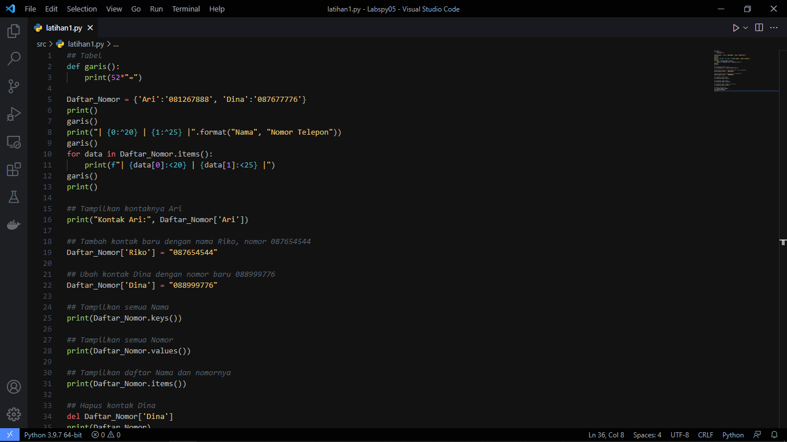
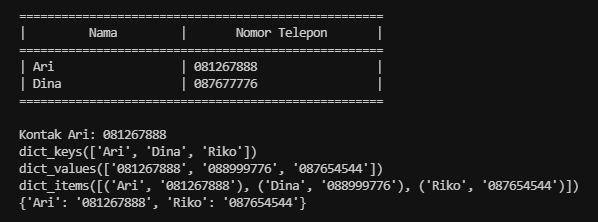
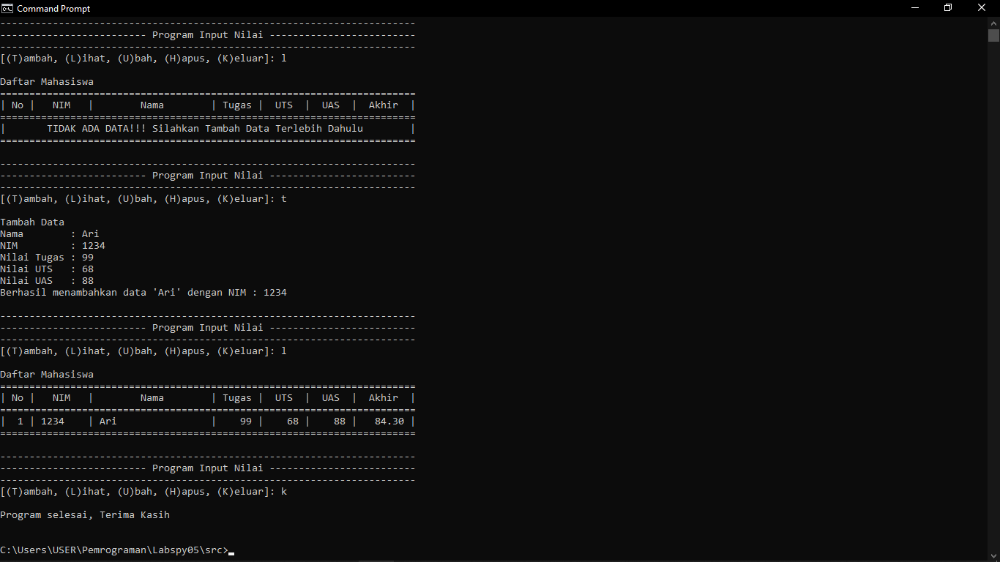

# Pertemuan 10
## Daftar isi
* [Latihan 1](https://github.com/kyuurazz/labspy05/#latihan-1)
* [Praktikum](https://github.com/kyuurazz/labspy05/#praktikum)
### Latihan 1
PROGRAM



OUTPUT



### Praktikum

Penjelasan:
 
 1. Deklarasi Dictionary sebagai database
 ```python
Data_Mahasiswa = {} 
 ```
 
 2. Membuat Function tambahan agar bisa dipanggil saat dibutuhkan
 ```python
def garis():
    print(71*"=")

def header():
    garis()
    print("| {0:^2} | {1:^7} | {2:^18} | {3:^5} | {4:^5} | {5:^5} | {6:^7} |".format("No", "NIM", "Nama", "Tugas", "UTS", "UAS", "Akhir"))
    garis()

def tidakAdaData(): 
    header()          
    print("|{0:^69}|".format("TIDAK ADA DATA!!! Silahkan Tambah Data Terlebih Dahulu"))
    garis()
 ```

 3. Membuat Function Program
#### Tambah()
- Memasukan data
- Jika sudah, maka data akan dimasukkan kedalam Dict `Data_Mahasiswa`
- Dimana Nama sebagai key dan sisanya values yang dimasukkan kedalam list
- Jika berhasil maka akan menampilkan "Berhasil menambahkan data 'nama' dengan NIM : nim"
 ```python
 def tambah():
    print("Tambah Data")
    nama       = input("Nama        : ")
    nim        = input("NIM         : ")
    nilaiTugas = int(input("Nilai Tugas : "))
    nilaiUTS   = int(input("Nilai UTS   : "))
    nilaiUAS   = int(input("Nilai UAS   : "))
    nilaiAkhir = (nilaiTugas * 30/100) + (nilaiUTS * 35/100) + (nilaiUAS * 35/100)
    Data_Mahasiswa[nama] = [nim, nilaiTugas, nilaiUTS, nilaiUAS, nilaiAkhir]
    print(f"Berhasil menambahkan data '{nama}' dengan NIM : {nim}") 
 ```

 #### Lihat()
 1) Apabila Dict `Data_Mahasiswa` masih kosong maka akan memanggil function `tidakAdaData`
 ```python
 def lihat():
    print("Daftar Mahasiswa")
    if len(Data_Mahasiswa) <= 0:  
        tidakAdaData()
 ```
 
2) Program Lihat Data Dijalankan
- Menggunakan looping untuk mengeluarkan data
- Dan menggunakan f-string agar tidak terlalu panjang dan format.string agar tampilan terlihat rapih
```python
else:
    no = 0
    header()
    for data in Data_Mahasiswa.items():
            no += 1 
            print(f"| {no:>2} | {data[1][0]:<7} | {data[0]:<18} | {data[1][1]:>5} | {data[1][2]:>5} | {data[1][3]:>5} | {data[1][4]:>7.2f} |")               
    garis() 
```

#### Ubah()
1) Apabila Dict `Data_Mahasiswa` masih kosong maka akan memanggil function `tidakAdaData`
 ```python
 def ubah():
    print("Ubah Data Mahasiswa berdasarkan Nama")
    if len(Data_Mahasiswa) <= 0:  
        tidakAdaData()
 ```
 
2) Function **ubah()** dijalankan berdasarkan nama
- Memasukan nama sebagai key dan akan memunculkan isi data dari key tersebut
- Jika salah memasukkan nama, maka akan mengeluarkan "data nama tidak ditemukan!"
- Selanjutnya akan diberi pilihan apa yang ingin diubah, jika ingin membatalkan maka ketik 0
- Jika salah memasukkan pilihan maka mengeluarkan "Pilihan input tidak ada! Silahkan masukan [1-3]"
 ```python
else:
   nama = input("Masukan nama : ")
   if nama in Data_Mahasiswa.keys():
      print(f"Nama        = {nama}")
      print(f"NIM         = {Data_Mahasiswa[nama][0]}")
      print(f"Nilai Tugas = {Data_Mahasiswa[nama][1]}")
      print(f"Nilai UTS   = {Data_Mahasiswa[nama][2]}")
      print(f"Nilai UAS   = {Data_Mahasiswa[nama][3]}")
      print(25*"=")
      print("1. Nama\n2. NIM\n3. Nilai\n0. Kembali")
      tanya = int(input("Apa yang ingin diubah? [1-3] : "))
      ...      
      elif tanya == 0:
          pass
          
      else:
          print(f"Pilihan {tanya} tidak ada! Silahkan masukan [1-3]")
   else:
      print(f"Data {nama} tidak ditemukan!") 
 ```
 
 ##### Ubah Nama
 Memasukan nama baru, nama akan berubah, maka akan mengeluarkan "Berhasil merubah Nama!"
 ```python
 if tanya == 1:
    _nama = input("Masukan Nama Baru : ")
    Data_Mahasiswa[_nama] = Data_Mahasiswa.pop(nama)
    print("Berhasil merubah Nama! ")
 ```

##### Ubah NIM
Memasukan NIM baru, NIM akan berubah, maka akan mengeluarkan "Berhasil merubah NIM!"
```python
elif tanya == 2:
    _nim = input("Masukan Nim Baru : ")
    Data_Mahasiswa[nama][0] = _nim
    print("Berhasil merubah NIM!")
```

##### Ubah Nilai
Memasukan nilai baru, nilai akan berubah, maka akan mengeluarkan "Berhasil merubah data nilai!"
```python
elif tanya == 3:
    _nilaiTugas = int(input("Masukan Nilai Tugas Baru : "))
    _nilaiUTS = int(input("Masukan Nilai UTS Baru : "))
    _nilaiUAS = int(input("Masukan Nilai UAS Baru : "))
    _nilaiAkhir = _nilaiTugas * 30/100 + _nilaiUTS * 35/100 + _nilaiUAS * 35/100
    Data_Mahasiswa[nama][1:4] = _nilaiTugas, _nilaiUTS, _nilaiUAS, _nilaiAkhir
    print("Berhasil merubah data nilai!")
```

#### Hapus()
1) Apabila Dict `Data_Mahasiswa` masih kosong maka akan memanggil function `tidakAdaData`
```python
def hapus():
    print("Hapus Data Mahasiswa berdasarkan Nama")
    if len(Data_Mahasiswa) <= 0:  
        tidakAdaData()
```

2) Program Hapus Data Dijalankan
- Memasukan nama sebagai key data yang ingin dihapus
- Jika salah memasukan nama ,maka akan mengeluarkan "data nama tidak ditemukan!"
```python
else:
     nama = str(input("Masukan nama : "))
     if(nama in Data_Mahasiswa):
         del Data_Mahasiswa[nama]
         print(f"Data {nama} berhasil dihapus!")
     else:
         print(f"Data {nama} tidak ditemukan!") 
```

#### Menu
- Menggunakan infinite loop sampai loopnya jadi false
- Apabila salah memasukkkan inputan maka akan muncul "Menu 'menu' tidak ada!"
- Jika benar maka function yang sudah dibuat akan dijalankan
```python
loop = True
while loop:
    print()
    print(71*"-")
    print(25*"-", "Program Input Nilai", 25*"-")
    print(71*"-")
    menu = input("[(T)ambah, (L)ihat, (U)bah, (H)apus, (K)eluar]: ")
    print()

    if menu == "T" or menu == "t":     
        tambah()

    elif menu == "L" or menu == "l":
        lihat()

    elif menu == "U" or menu == "u":
        ubah() 

    elif menu == "H" or menu == "h":
        hapus()

    elif menu == "K" or menu == "k":
        print("Program selesai, Terima Kasih")
        print()
        loop = False 

    else:
        print(f"Menu '{menu}' tidak ada!")
```

### Output


[Kembali ke Daftar Isi](https://github.com/kyuurazz/labspy05#daftar-isi)